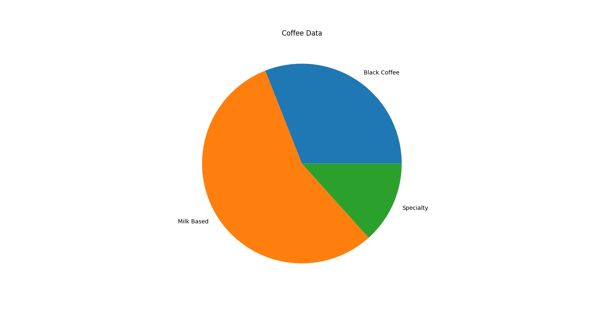
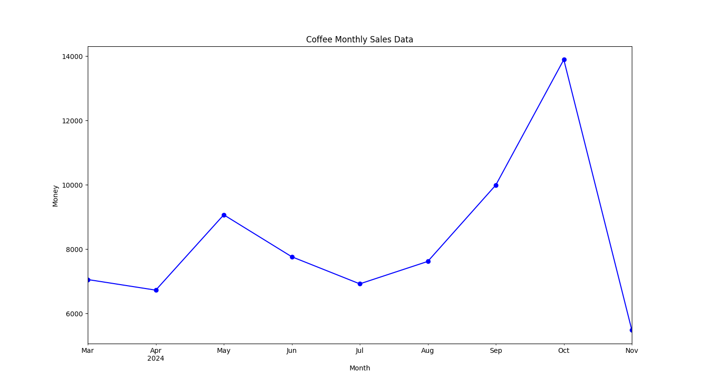
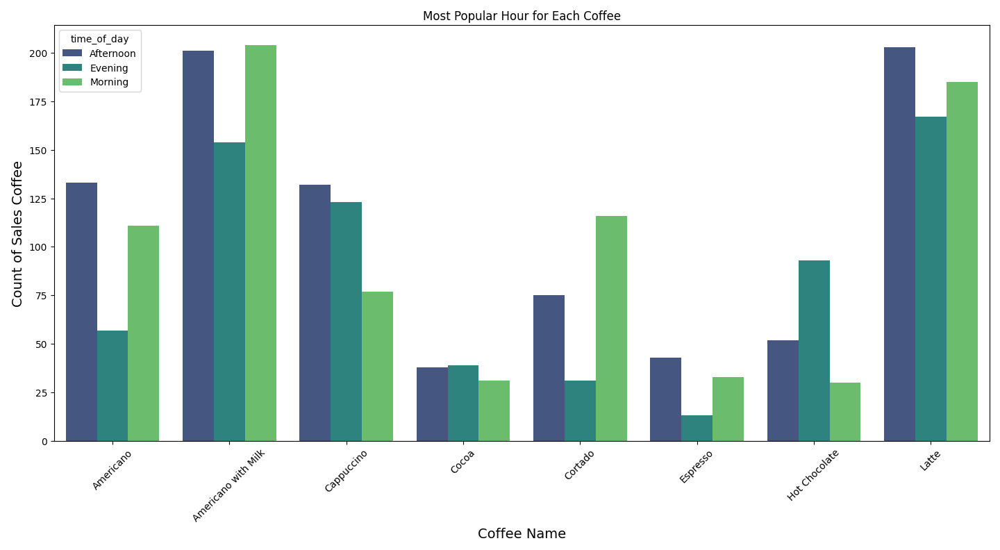
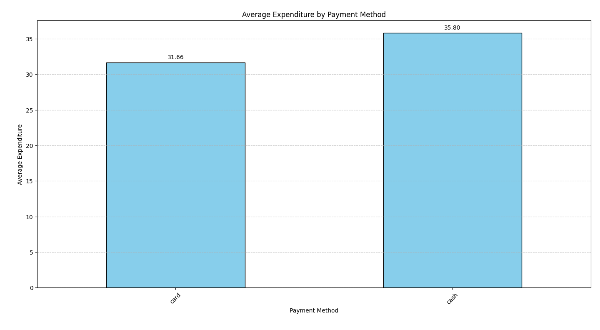
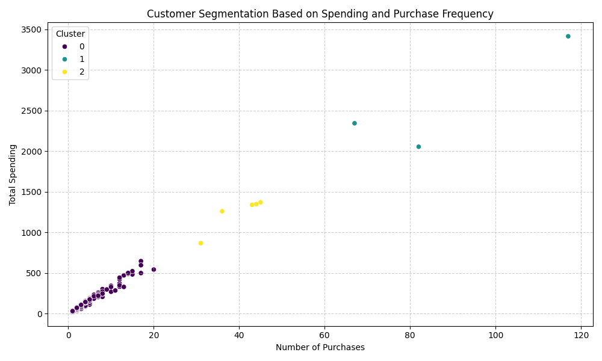

This is my first project visualizing data using Python's **Matplotlib** and **Seaborn** libraries. The project focuses on analyzing coffee sales trends, customer behaviors, and time-based patterns.

# What I Did
- Cleaned and prepared the coffee sales dataset.
- Analyzed data to identify sales trends by time of day, coffee categories, and payment methods.
- Created visualizations like bar charts and pie charts to present insights clearly.

1. This pie chart visualizes the distribution of coffee sales by category. The "Milk Based" category accounts for the largest share, followed by "Black Coffee" and "Specialty" categories. This categorization helps understand the popularity of different types of coffee among customers.

2. This line chart visualizes monthly coffee sales trends over the year. Sales peaked significantly in October, with a smaller peak in May. The lowest sales occurred in November, highlighting possible seasonal or promotional impacts.

3. This bar chart visualizes the most popular times of day for each coffee type. Different time periods (Morning, Afternoon, Evening) are represented by colors, showing trends such as "Latte" and "Americano with Milk" being most popular in the morning and afternoon, while "Hot Chocolate" sees higher sales in the evening.

4. This bar chart shows the average spending for each payment method (card and cash).

5. This scatter plot visualizes customer segmentation using the KMeans Algorithm, dividing them into 3 groups (clusters) based on their total spending and purchase frequency. The clusters range from Low (0) to High (2), identifying spending patterns and customer behavior.
